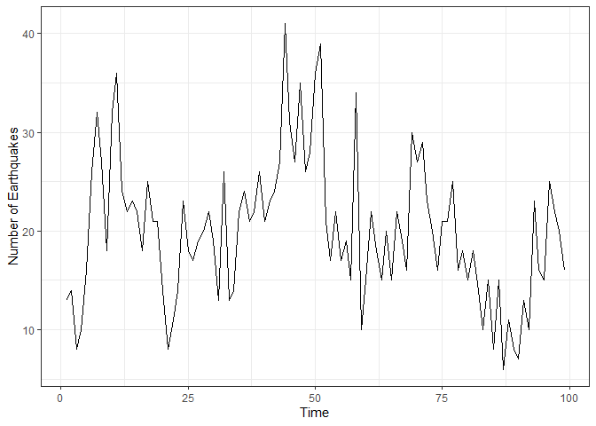
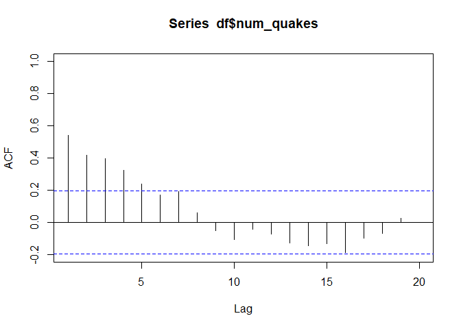
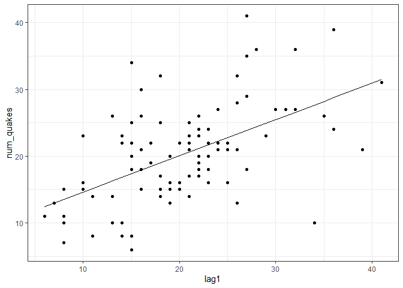
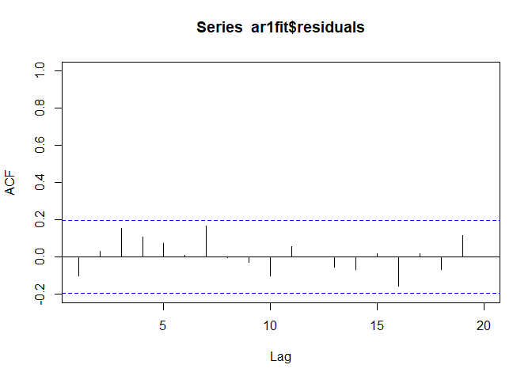
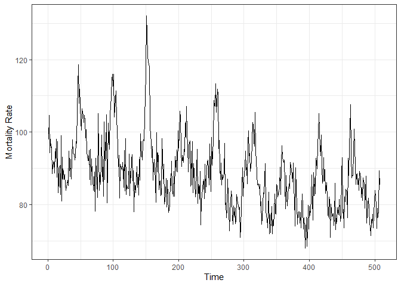
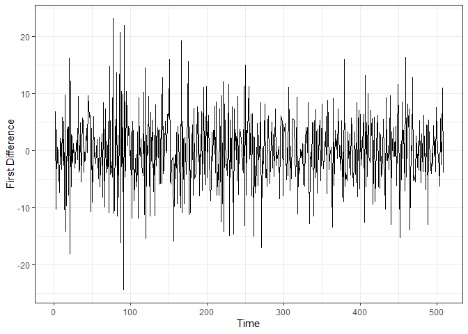
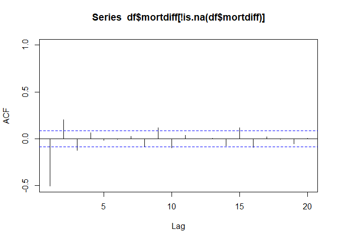
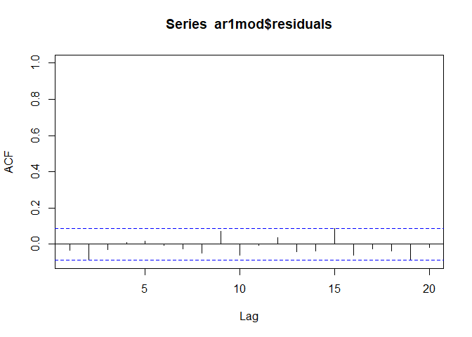

Exploring AR(1) Relationships in R
================

# Navigation

1.  [Earthquakes](#quakes)

    - [Data Exploration](#data-exploration)
    - [ACF](#acf)
    - [Relationship between x(t) and
      x(t-1)](#relationship-between-xt-and-xt-1)
    - [ACF of Residuals](#acf-of-residuals)

2.  [Cardiovascular Mortality Rate](#cmort)

    - [Data Exploration](#data-exploration-1)
    - [First Differences](#first-differences)
    - [ACF](#acf-1)
    - [Relationship between x(t) and
      x(t-1)](#relationship-between-xt-and-xt-1-1)
    - [ACF of Residuals](#acf-of-residuals-1)

# Quakes

This data is the annual number of earthquakes worldwide with a magnitude
greater than 7.0 on the seismic scale.

``` r
library(dplyr)
```

    ## 
    ## Attaching package: 'dplyr'

    ## The following objects are masked from 'package:stats':
    ## 
    ##     filter, lag

    ## The following objects are masked from 'package:base':
    ## 
    ##     intersect, setdiff, setequal, union

``` r
library(ggplot2)
theme_set(theme_bw())

# Read data and turn into data frame
x <- scan('https://online.stat.psu.edu/stat510/sites/stat510/files/L01/quakes.dat')
df <- data.frame(time = 1:length(x), num_quakes = x)

# Create lag(1) variable
df <- df %>%
  arrange(time) %>%
  mutate(lag1 = lag(num_quakes, 1))
```

## Data Exploration

First we plot the time series

``` r
ggplot(aes(x = time, y = num_quakes), data = df) +
  geom_line() +
  xlab('Time') +
  ylab('Number of Earthquakes')
```

<!-- -->

## ACF

Then we plot the ACF of the lags

``` r
acf(x = df$num_quakes, xlim = c(1,20))
```

<!-- -->

This shows that we have significant lags at 1, 2, 3, 4, and 5, with 1
being the largest.

- Significant ACF indicates that data are not independent over time

## Relationship between x(t) and x(t-1)

Then we plot the number of earthquakes against its lag(1). Let’s look at
the linear relationship between $x_t$ and its first lag $x_{t-1}$

``` r
# Linear model of x ~ lag(1)
ar1fit <- lm(num_quakes ~ lag1, data = df)
df$pred <- predict(ar1fit, newdata = df)

summary(ar1fit)
```

    ## 
    ## Call:
    ## lm(formula = num_quakes ~ lag1, data = df)
    ## 
    ## Residuals:
    ##     Min      1Q  Median      3Q     Max 
    ## -17.666  -3.901  -0.351   3.050  17.138 
    ## 
    ## Coefficients:
    ##             Estimate Std. Error t value Pr(>|t|)    
    ## (Intercept)  9.19070    1.81924   5.052 2.08e-06 ***
    ## lag1         0.54339    0.08528   6.372 6.47e-09 ***
    ## ---
    ## Signif. codes:  0 '***' 0.001 '**' 0.01 '*' 0.05 '.' 0.1 ' ' 1
    ## 
    ## Residual standard error: 6.122 on 96 degrees of freedom
    ##   (1 observation deleted due to missingness)
    ## Multiple R-squared:  0.2972, Adjusted R-squared:  0.2899 
    ## F-statistic:  40.6 on 1 and 96 DF,  p-value: 6.471e-09

The model shows statistical significance with an $R^2$ value of 0.2972 -
indicating that the lag(1) explains about 30% of the variance in a given
day’s number of earthquakes can be explained by the number of
earthquakes on the previous day.

Let’s look at this in a line graph

``` r
ggplot(data = df) +
  geom_point(aes(x = lag1, y = num_quakes)) +
  geom_line(aes(x = lag1, y = pred))
```

<!-- -->

## ACF of residuals

Next we check the autocorrelation function of the residuals to check if
the model has properly captured the time dependence - good models should
leave uncorrelated residuals.

Significant ACF means the model is missing structure; residuals should
behave like random noise (white noise).

``` r
acf(ar1fit$residuals, xlim = c(1,20))
```

<!-- -->

There are no significant ACF values for the residuals - meaning no ARIMA
terms, more lags, or transformations should be necessary.

# Cmort

This data concerns the weekly cardiovascular mortality rate in Los
Angeles County.

``` r
x <- scan('https://online.stat.psu.edu/stat510/sites/stat510/files/L01/cmort.dat')
df <- data.frame(mortality_rate = x, time = 1:length(x))
```

## Data exploration

First we plot the time series

``` r
ggplot(aes(x = time, y = mortality_rate), data = df) +
  geom_line() +
  xlab('Time') +
  ylab('Mortality Rate')
```

<!-- -->

There is a slight downward trend, so the series may not be stationary.

## First differences

To create a (possibly) stationary series, we’ll examine the first
differences.

``` r
df$mortdiff <- c(NA, diff(df$mortality_rate))
```

Let’s see what this looks like

``` r
ggplot(aes(x = time, y = mortdiff), data = df) +
  geom_line() +
  xlab('Time') +
  ylab('First Difference')
```

<!-- -->

This looks a lot more stationary

## ACF

Now we look at the autocorrelation function of the first difference

``` r
acf(df$mortdiff[!is.na(df$mortdiff)], xlim = c(1, 20))
```

<!-- -->

This looks like the pattern of an AR(1) with a negative lag 1
autocorrelation.

## Relationship between x(t) and x(t-1)

``` r
df <- df %>%
  arrange(time) %>%
  mutate(lag1 = lag(mortdiff, 1))

ar1mod <- lm(mortdiff ~ lag1, data = df)
summary(ar1mod)
```

    ## 
    ## Call:
    ## lm(formula = mortdiff ~ lag1, data = df)
    ## 
    ## Residuals:
    ##      Min       1Q   Median       3Q      Max 
    ## -19.2758  -3.8753  -0.0953   3.5725  20.8169 
    ## 
    ## Coefficients:
    ##             Estimate Std. Error t value Pr(>|t|)    
    ## (Intercept) -0.04627    0.25900  -0.179    0.858    
    ## lag1        -0.50636    0.03838 -13.195   <2e-16 ***
    ## ---
    ## Signif. codes:  0 '***' 0.001 '**' 0.01 '*' 0.05 '.' 0.1 ' ' 1
    ## 
    ## Residual standard error: 5.826 on 504 degrees of freedom
    ##   (2 observations deleted due to missingness)
    ## Multiple R-squared:  0.2568, Adjusted R-squared:  0.2553 
    ## F-statistic: 174.1 on 1 and 504 DF,  p-value: < 2.2e-16

This shows a negative linear relationship between $x_t$ and its first
lag. The R-squared value of 0.2568 means that the difference between the
previous mortality rate of a day and the day before that explains about
26% of the variance in the difference between mortality rate of the
present day and the previous day.

- More concisely: how much the previous day’s change explains the
  current day’s change

## ACF of Residuals

Now we check the autocorrelation function of the residuals

``` r
acf(ar1mod$residuals, xlim = c(1, 20))
```

<!-- -->

No significant ACF of residuals - meaning the model has successfully
captured the time dependence in the data, and the residuals now behave
like white noise (i.e., uncorrelated, random error)
